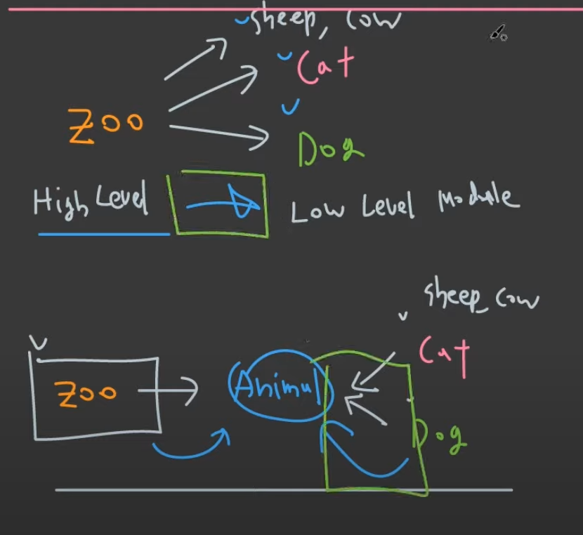

# SOLID Principles

SOLID 원칙은 소프트웨어 개발과 관련된 객체 지향 설계 개념입니다.  
SOLID는 5가지 다른 클래스 설계 원칙의 약어입니다.  

- Single Responsibility
- Open-Closed
- Liskov Substitution
- Interface Segregation
- Dependency Inversion


<br/><br/>

## SRP(단일 책임 원칙)(Single Responsibility)
하나의 클래스에는 하나의 책임이 있어야 합니다.  
함수도 하나의 책임만 가져야한다.

#### Before - 위반 

```java
public class Cat {
    int age;
    String name;

    public Cat(int age, String name) {
        this.age = age;
        this.name = name;
    }

    void eat() {}
    void walk() {}
    void speak() {}

    // SRP 위반 : 프린트 함수는 고양이의 기능이 아니다.
    void print() {
        System.out.println("age:" + age + " name:" + name);
    }

    public static void main(String[] args) {
        Cat cat = new Cat(10, "coco");
        cat.print();
    }
}

```

#### After

```java
public class Cat {
    int age;
    String name;

    public Cat(int age, String name) {
        this.age = age;
        this.name = name;
    }

    void eat() {}
    void walk() {}
    void speak() {}

    // 고양이의 상태를 알려주는 함수로 변경 
    String repr() {
        return "age:" + age + " name:" + name;
    }

    public static void main(String[] args) {
        Cat cat = new Cat(10, "coco");

        // 프린트는 외부에서 해준다.
        System.out.println(cat.repr());
    }
}
```


<br/><br/>

## OCP(개방-폐쇄 원칙)(Open-Closed)
소프트웨어 구성 요소는 확장을 위해 열려 있어야 하지만 수정을 위해 닫혀 있어야 합니다.

#### Before - 위반 

```java
public class Client {
    public static void main(String[] args) {

        Animal kitty = new Animal("Cat");
        Animal bingo = new Animal("Dog");

        // OCP 위반 : 확장에 닫혀 있음. hey를 수정하지 않고는 동물의 종류를 추가 할 수 없다.
        Animal cow = new Animal("Cow");
        Animal sheep = new Animal("Sheep");

        hey(kitty);
        hey(bingo);
        hey(cow);
        hey(sheep);
    }

    // OCP 위반: 만약에 동물의 종류가 추가되면 아래 함수도 수정해줘야 한다.
    static void hey(Animal animal) {
        if (animal.type.equals("Cat")) {
            System.out.println("meow");
        } else if (animal.type.equals("Dog")) {
            System.out.println("bark");
        } else {
            throw new RuntimeException("wrong type");
        }
    }
}

class Animal {
    String type;

    public Animal(String type) {
        this.type = type;
    }
}

```


#### After

```java
public class Client {
    public static void main(String[] args) {

        Animal kitty = new Cat();
        Animal bingo = new Dog();

        hey(kitty);
        hey(bingo);


        // 확장에 열여 있음.
        Animal cow = new Cow();
        Animal sheep = new Sheep();

        hey(cow);
        hey(sheep);
    }

    // 기존 코드 수정하지 않음.
    static void hey(Animal animal) {
       animal.speak();
    }
}

interface Animal {
    void speak();
}
class Cat implements Animal{
    @Override public void speak() { System.out.println("meow"); }
}
class Dog implements Animal{
    @Override public void speak() { System.out.println("bark"); }
}
class Cow implements Animal{
    @Override public void speak() { System.out.println("moo"); }
}
class Sheep implements Animal{
    @Override public void speak() { System.out.println("meh"); }
}
```


<br/><br/>

## LSP(리스코프 치환 원칙)(Liskov Substitution)
파생 유형은 기본 유형을 완전히 대체할 수 있어야 합니다.  
부모-자식 클래스 관계에서 자식은 부모를 대신 할 수 있어야 하는데, 자식은 부모의 설계 의도를 지켜야한다.

LSP는 파생 클래스가 기본 클래스를 완전히 대체할 수 있도록 상속 계층에 적용됩니다.  
LSP를 위반하면 정의되지 않은 동작이 발생하여 버그가 있는 위치를 찾는 데 몇 주가 소요될 수 있습니다.

<br/><br/>

#### 위반 예제 

1. 생선은 고양이를 대체하지 못한다.
```java
public class Client {
    public static void main(String[] args) {

        Cat cat = new Cat();
        speak(cat);

        Cat blackCat = new BlackCat();
        speak(blackCat);

        // LSP 위반 : 파생 클래스가 기본 클래스를 완전히 대체하지 못함.
        Cat fish = new Fish();
        speak(fish);
    }

    static void speak(Cat cat) {
        cat.speak();
    }
}

class Cat {
    public void speak() {System.out.println("meow");}
}
class BlackCat extends Cat{
    public void speak() {System.out.println("black meow");}
}
class Fish extends Cat{
    public void speak() { throw new RuntimeException("Fish can't speak");}
}
```

<br/><br/>

2. Rectangle 기본 클래스를 파생 클래스 Square로 바꿀 수 없기 때문에 위의 클래스는 LSP를 따르지 않습니다. 
   - Square 클래스에는 추가 제약 조건이 있습니다. 즉, 높이와 너비가 동일해야 합니다.
   - 따라서 Rectangle을 Square 클래스로 대체하면 예기치 않은 동작이 발생할 수 있습니다.  

```java
public class Rectangle {
    private double height;
    private double width;

    public double area();

    public void setHeight(double height){...};
    public void setWidth(double width){...};
}


public class Square extends Rectangle {

    public void setHeight(double height) {
        super.setHeight(height);
        super.setWidth(height);
    }

    public void setWidth(double width) {
        setHeight(width);
    }
}
```


<br/><br/>

## ISP(인터페이스 분리 원칙)(Interface Segregation)
클라이언트는 사용하지 않을 불필요한 방법을 구현하도록 강요되어서는 안됩니다.

#### Before - 위반 

```java
interface  ICar {
    void drive();
    void turnLeft();
    void turnRight();

    void steer();
    void steerLeft();
    void steerRight();
}

class RoadCar implements ICar{
    @Override public void drive() { System.out.println("사용함"); }
    @Override public void turnLeft() { System.out.println("사용함"); }
    @Override public void turnRight() { System.out.println("사용함"); }

    @Override public void steer() {/* 사용하지 않음 */}
    @Override public void steerLeft() {/* 사용하지 않음 */}
    @Override public void steerRight() {/* 사용하지 않음 */}
}

class BoatCar implements ICar{
    @Override public void drive() {/* 사용하지 않음 */}
    @Override public void turnLeft() {/* 사용하지 않음 */}
    @Override public void turnRight() {/* 사용하지 않음 */}

    @Override public void steer() { System.out.println("사용함"); }
    @Override public void steerLeft() { System.out.println("사용함"); }
    @Override public void steerRight() { System.out.println("사용함"); }
}

```

#### After

```java
interface  ICar {
    void drive();
    void turnLeft();
    void turnRight();
}

interface IBoat{
    void steer();
    void steerLeft();
    void steerRight();
}

class RoadCar implements ICar{
    @Override public void drive() { System.out.println("사용함"); }
    @Override public void turnLeft() { System.out.println("사용함"); }
    @Override public void turnRight() { System.out.println("사용함"); }
}

class Boat implements IBoat{
    @Override public void steer() { System.out.println("사용함"); }
    @Override public void steerLeft() { System.out.println("사용함"); }
    @Override public void steerRight() { System.out.println("사용함"); }
}

class BoatCar implements ICar, IBoat{
    @Override public void drive() { System.out.println("사용함"); }
    @Override public void turnLeft() { System.out.println("사용함"); }
    @Override public void turnRight() { System.out.println("사용함"); }

    @Override public void steer() { System.out.println("사용함"); }
    @Override public void steerLeft() { System.out.println("사용함"); }
    @Override public void steerRight() { System.out.println("사용함"); }
}

```


<br/><br/>

## DIP(의존 역전 원칙)(Dependency Inversion)
구체화가 아닌 추상화에 의존

#### Before - 위반 

```java
class Cat {
   void speak() {}
}

class Dog {
   void speak() {}
}

class Sheep {
   void speak() {}
}

class Cow {
   void speak() {}
}

class Zoo {
   Cat cat;
   Dog dog;
   Sheep sheep;
   Cow cow;

   public Zoo(Cat cat, Dog dog, Sheep sheep, Cow cow) {
      this.cat = cat;
      this.dog = dog;
      this.sheep = sheep;
      this.cow = cow;
   }
}
```


#### After
high level 클래스(zoo)와 low level 클래스(cat, dog) 모두 추상화 클래스(animal)에 의존하게 만든다.  
이러한 과정에서 화살표 방향이 바뀌기 것을 dependency inversion 이라고 한다.



```java
class Animal {
   void speak() {}
}

class Cat extends Animal {
   void speak() {}
}

class Dog extends Animal {
   void speak() {}
}

class Sheep extends Animal {
   void speak() {}
}

class Cow extends Animal {
   void speak() {}
}

/* Animal 종류가 추가 되어도 Zoo는 수정할 필요 없어진다. */
class Zoo {
   List<Animal> animals = new ArrayList<>();

   void addAnimal(Animal animal) {
      animals.add(animal);
   }

   void speakAll() {
      for (Animal animal : animals) {
         animal.speak();
      }
   }
}
```
